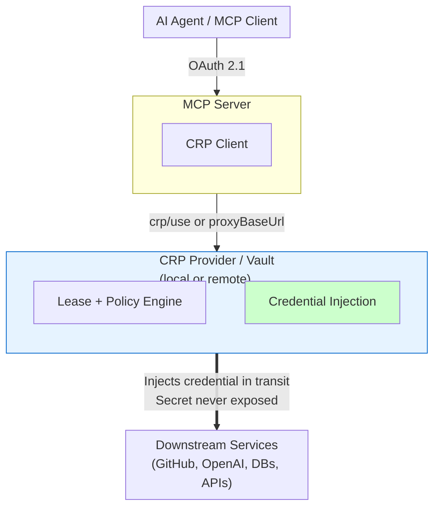
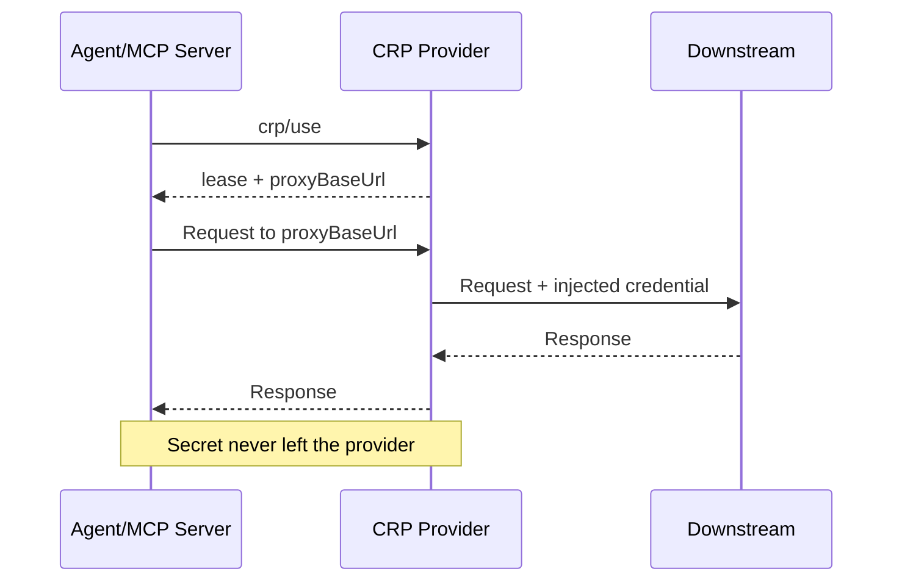
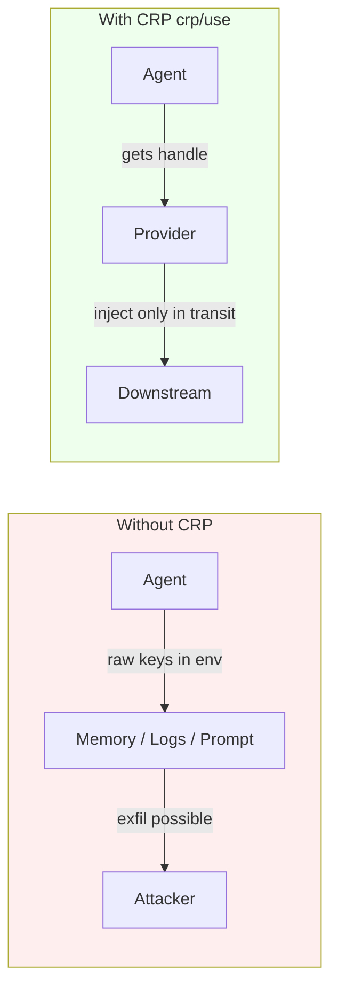
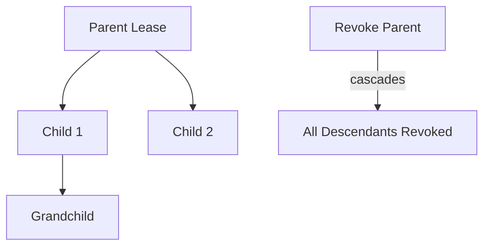

# Credential Resolution Protocol (CRP) v0.2

**Status:** Proposed  
**Version:** 0.2.0  
**Date:** 2026-07-17  
**Authors:** Jason Gale (SanctumAI)  
**Target:** MCP Working Group  

This is the submission text for CRP as an MCP `experimental` capability.
The protocol is defined around **`crp/use`** (use-not-retrieve). Credential
material is never returned to the consumer on the default path.

---

## 0. Motivation

MCP OAuth 2.1 secures the hop from client to MCP server. It does nothing for the critical second hop: the MCP server reaching out to downstream services (GitHub, OpenAI, databases, internal APIs) using the user's credentials.

Today those credentials live in plaintext `.env` files or are passed through the agent. A single prompt injection, compromised tool, or leaked config can exfiltrate them with no visibility and unlimited blast radius.

The Credential Resolution Protocol (CRP) standardizes this last mile. It lets MCP servers **use** credentials **without the secret ever leaving a trusted provider**.

CRP remains lightweight, provider-agnostic, and incremental via MCP's `experimental` capability mechanism.

---

## 1. Abstract

The Credential Resolution Protocol (CRP) defines a standard interface for MCP servers to obtain the credentials they need for downstream APIs **without those credentials ever being exposed to the agent or, in the normal case, to the MCP server itself**.

CRP provides:
- Lease-based access with TTL, scope, and immediate revocation
- A **`crp/use`** primitive that keeps secrets inside the provider
- Support for delegation, identity brokering, classification, and policy-driven graduated outcomes
- Mandatory audit

It operates as an MCP `experimental` capability. Any local or remote vault provider can implement it.

---

## 1.1 The Problem and the Vision

### The Gap

OAuth 2.1 only protects the client-to-MCP-server hop. The server still needs real credentials for everything it does on the user's behalf. These currently live in plaintext with no standard controls.

```
Client --OAuth 2.1--> MCP Server --???--> Downstream APIs
                              (raw keys in env)
```

A prompt injection or malicious tool can steal them instantly.

### The CRP Vision: Automatic Protection

CRP draws inspiration from WCCP (Web Cache Communication Protocol), which made advanced network services appear automatically for devices on the network.

CRP aims for the same experience for AI agents:

> When an MCP server declares support for CRP, agents get strong, auditable, never-exposed credential access **by default** — with no extra work from the developer.

The two primary consumption models are:
- **Transparent proxy** (change a base URL — ideal for SDKs)
- **`crp/use`** (structured lease + handle — ideal for tool-calling agents)

Both achieve the same security property: the secret never leaves the provider.

**Visual: CRP in the MCP Stack**



---

## 2. Design Goals

1. **Use, don't retrieve** — The protocol never returns a secret on the conforming path.
2. **Simple to implement** — A basic conforming provider can be built in days.
3. **Provider agnostic** — Any vault (local or remote) can participate.
4. **Bounded and revocable** — Leases have clear scope, TTL, and delegation limits.
5. **Identity native** — First-class support for brokered federated tokens.
6. **Incremental** — Works via MCP `experimental`; no breaking changes to core MCP.

---

## 3. Terminology

| Term | Definition |
|------|------------|
| **Use-handle** | A `{lease, proxyBaseUrl}` pair. The consumer calls the proxy URL; the provider injects the credential. |
| **Delegated lease** | A child lease derived from a parent with bounded depth. Revocation of the parent cascades. |
| **Brokered credential** | A short-lived token minted by the provider via exchange of a root secret (never seen by consumer). |
| **Classification** | Sensitivity label: `public` < `internal` < `confidential` < `restricted`. |
| **Graduated outcome** | Policy result other than allow/deny: `require_approval` or `quarantine`. |

---

## 4. Capability Negotiation

Providers advertise CRP support under `experimental.crp`:

```json
"experimental": {
  "crp": {
    "version": "0.2",
    "provider": "example-vault",
    "features": ["use", "list", "lease", "revoke", "delegate", "broker", "classify"],
    "conformance": "standard"
  }
}
```

- `version` negotiation is normative. Mismatch MUST return error `-33001`.
- `conformance` MUST accurately reflect implemented tier (see Section 8).
- `features` lists only operations the provider actually supports.
- Conforming providers MUST include `"use"`.

---

## 5. Operations

### 5.1 `crp/use` — Obtain a Use-Handle (REQUIRED)

This is the primary and only credential-access operation defined by CRP.

**Request**
```json
{
  "method": "crp/use",
  "params": {
    "service": "github.com/api",
    "scopes": ["repo:read"],
    "ttl": 3600,
    "delegation": { "parentLeaseId": "...", "maxDepth": 2 },
    "identityScope": "agent-xyz",
    "context": { "consumer": "mcp-github", "purpose": "...", "traceId": "..." }
  }
}
```

**Success Response**
```json
{
  "result": {
    "lease": {
      "id": "lease-7f3a",
      "expiresAt": "...",
      "ttl": 3600,
      "renewable": true,
      "delegationDepth": 0
    },
    "proxyBaseUrl": "http://127.0.0.1:7700/api/v1/proxy/t/lease-7f3a",
    "service": "github.com/api",
    "grantedScopes": ["repo:read"],
    "credentialDescriptor": {
      "type": "oauth_bearer",
      "brokered": false,
      "autoRefresh": false,
      "classification": "confidential"
    }
  }
}
```

**Key Properties**
- The response contains **no secret**.
- `proxyBaseUrl` MUST remain stable for the life of the lease (including renewals).
- The consumer makes normal HTTP calls against the proxy URL. The provider injects credentials in transit.
- Conforming providers MUST NOT return credential material in the `crp/use` response.

#### 5.1.1 Sequence: secret never leaves the provider



A leaked use-handle has dramatically smaller blast radius: it is scoped, time-bounded, only works through the provider, and can be instantly revoked.

### 5.2 `crp/list` — Discover services (OPTIONAL)

Returns available service identifiers and classification metadata. MUST NOT return secrets.

### 5.3 `crp/lease` — Renew / release (RECOMMENDED)

Extend TTL or release a lease. Renewed leases MUST keep the same `proxyBaseUrl`.

### 5.4 `crp/revoke` — Emergency revocation (RECOMMENDED)

Revoke a lease. MUST return `affectedLeases` for any cascaded revocations of delegated children.

### 5.5 Delegation

A consumer can request a delegated lease. The provider enforces depth limits. Revocation of any ancestor revokes the entire subtree.

---

## 6. Credential Types

### 6.1 Static Credentials
`api_key`, `oauth_bearer`, `basic_auth`, `connection_string`, `custom`.

Under `crp/use` only the **descriptor** is returned — never the material.

### 6.2 Brokered / Federated Credentials

When `identityScope` is supplied, the provider performs the exchange (e.g. Entra Agent ID federated credential or OAuth2 client-credentials) and injects a short-lived token via the proxy. The root secret and minted token stay inside the provider.

---

## 7. Graduated Outcomes

A `crp/use` request can return:

| Code | Name | Consumer Action |
|------|------|-----------------|
| -33020 | `require_approval` | Surface for human approval; poll or retry |
| -33021 | `quarantine` | Stop. Do not retry without operator action |

These outcomes are returned instead of a handle when policy requires it.

---

## 8. Conformance Tiers

| Tier | Level of Effort | REQUIRED Operations |
|------|-----------------|---------------------|
| **Basic** | Weekend | `crp/use`, lease lifecycle, audit-by-default |
| **Standard** | ~1 week | Basic + `crp/list`, `crp/revoke`, version negotiation, classification |
| **Full** | Production-ready | Standard + delegation, brokering, graduated outcomes, policy enforcement |

Providers MUST accurately advertise their conformance tier.

---

## 9. Relationship to Transparent Proxy

CRP defines the **negotiation and lease semantics**. Many implementations also expose an HTTP transparent proxy at the `proxyBaseUrl`.

The two models are complementary:
- Use `crp/use` when you want structured control.
- Point an SDK's `base_url` at the proxy URL for zero-code-change usage.

Both keep the secret inside the provider.

---

## 10. Security Considerations

**Core Guarantee**: Credential material never leaves the provider on the conforming path.

**Lease Containment**
- A use-handle is useless without the provider.
- TTL + scope + instant revocation limit damage.

**Delegation Safety**
- Depth is bounded.
- Cascade revocation prevents orphaned grants.

**Brokering**
- Root secrets never leave the provider.
- Minted tokens are short-lived and identity-scoped.

**No raw secret export**
- CRP does not define a method that returns credential material to the consumer.
- Implementations that offer proprietary break-glass export are outside CRP conformance for that path and MUST NOT advertise it as CRP.

**Provider Requirements**
- Implementations MUST NOT log credential material.
- All use must be auditable.
- Revocation MUST take effect for subsequent requests.

---

## 11. Error Codes

v0.2 defines codes for version mismatch (`-33001`), policy denial, lease not found, delegation depth exceeded, broker failure, and graduated outcomes (`-33020`, `-33021`). Implementations MUST emit version-mismatch when negotiation fails.

---

## 12. Examples

### crp/use

```json
// Request
{ "method": "crp/use", "params": { "service": "github.com/api", "ttl": 3600 } }

// Response
{
  "lease": { "id": "l-123", "expiresAt": "...", "ttl": 3600 },
  "proxyBaseUrl": "http://localhost:7700/api/v1/proxy/t/l-123"
}
```

**SDK usage**
```python
handle = crp.use("github.com/api")
# Point existing client at the provider proxy — secret never returned
client = SomeApi(base_url=handle.proxy_base_url, token=handle.session_token)
```

### Transparent Proxy (SDK-friendly)

```bash
# Operator: mint a lease (provider-specific tooling)
# Agent / SDK: only changes base URL
export API_BASE_URL="http://127.0.0.1:7700/api/v1/proxy/t/lease-abc"
```

---

## 13. Adoption

- Implement `crp/use` first; advertise `"use"` in `features`.
- Prefer transparent proxy for existing SDKs; structured `crp/use` for tool-calling agents.
- Version negotiation prevents silent incompatibility.

---

## Visual Diagrams

### Blast Radius



### Delegation Cascade



---

**End of Specification**

*Intended for discussion in the MCP Working Group. Feedback on clarity, security properties, and implementability is welcome.*
